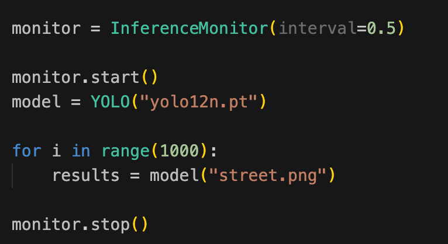
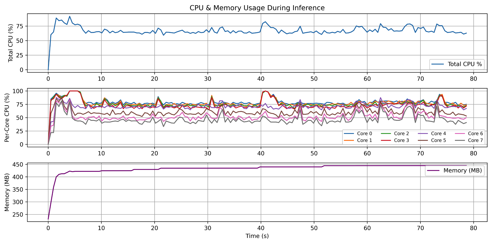
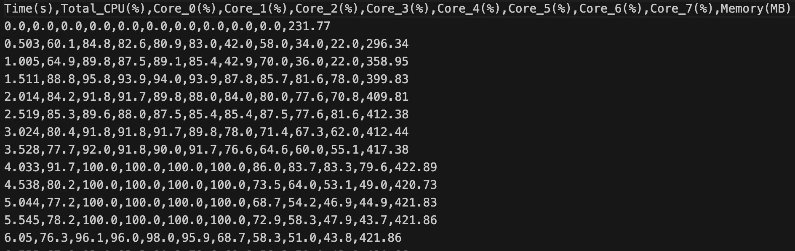

# 📊 InferenceMonitor (GPU 추가예정)
Python으로 추론(inference) 중 시스템 리소스(CPU 및 메모리) 사용량을 모니터링하고, 이를 시각화/CSV로 저장하는 도구입니다.

---
✅ 기능
- 전체 CPU 사용률 및 코어별 사용률 기록
- 메모리 사용량(MB 단위) 기록
- 실시간 모니터링 (쓰레드 기반)
- .csv 파일로 결과 저장
- .png 이미지로 시각화 저장
---

## 설치 방법

```bash
pip install git+https://github.com/choimagon/inferenceMonitor.git
```
### 지우기
```
pip uninstall Inference_Monitor
```

## 사용 방법
```
from InferenceMonitor import InferenceMonitor (이거 정의해야함.)
```
interval로 측정 간격 설정 가능 0.5하면 0.5초 <br>


추론 코드의 앞부분에 `start()` 를, 뒷부분에 `stop()` 을 호출하여 리소스 측정의 시작과 종료 시점을 설정함.

## 출력 예시 


---
#### 이미지


#### CSV


